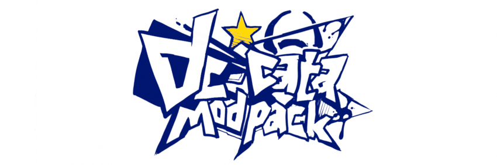
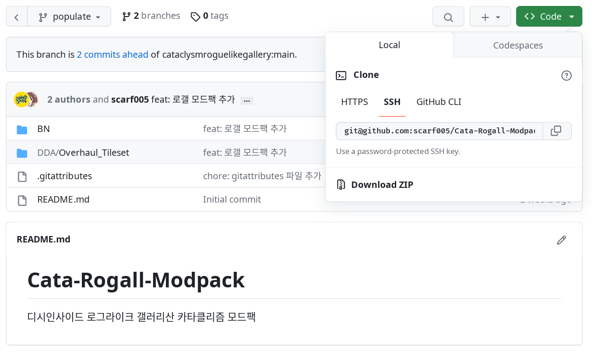

# Cata-Rogall-Modpack

디시인사이드 로그라이크 갤러리산 카타클리즘 모드팩

## 디렉터리 구조

### BN

- [AZFs_Mod](./BN/AZFs_Mod):
- [Dogmeat's Mod](./BN/Dogmeat's%20Mod): 가방 편의성 증가 모드
- [Jakes_Squirrel_mod](./BN/Jakes_Squirrel_mod): 파밍을 위한 다양한 컨텐츠 및 확장된 나노기술 활용 컨텐츠 추가 모드.
- [New England Staff Arts](./BN/New%20England%20Staff%20Arts/): 무술: 뉴 잉글랜드 지팡이술을 추가합니다. 자동습득 가능합니다.
- [Revive_Hub01_Base](./BN/Revive_Hub01_Base/): 삭제된 허브01의 지하실, 그리고 허브01의 보안책임자 율리시스 루크를 되살리는 모드입니다.
- [Oil_and_Spinner](./BN/Oil_and_Spinner/): 심플하게 압착기와 방적기를 추가합니다.
- [Old_Ammo_Stats](./BN/Old_Ammo_Stats/): 현재까지 BN 버전 패치로 진행된 탄약 리밸런싱을 롤백시키고 예전의 스탯을 복구시키는 모드입니다.
- [better_cataclysm](./BN/better_cataclysm/): 카타클리즘의 불합리하고 불공평한 부분을 수정합니다.

### DDA

- [Overhaul_Tileset](./DDA/Overhaul_Tileset/): MX+Tileset(Overhaul)의 모드판. Overhaul 타일셋을 적용시키고, 새로운 외형을 추가합니다.

## 모드팩 설치법

1. 이 저장소 우측 위 초록색 `Code` 버튼을 누릅니다.
2. 아래에 있는 `Download ZIP`을 누릅니다.
3. 다운로드가 완료되면 압축을 풀고, 내부의 `BN` 또는 `DDA` 디렉터리에 있는 모드 폴더들을 카타클리즘의 `mods` 폴더에 넣습니다.
