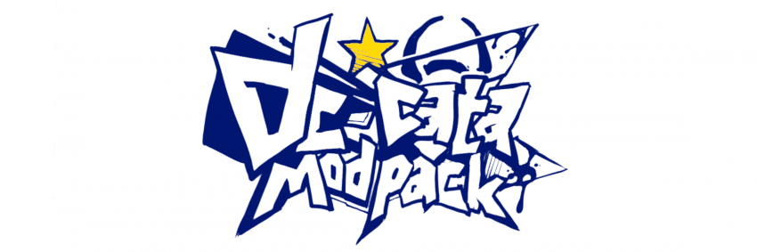
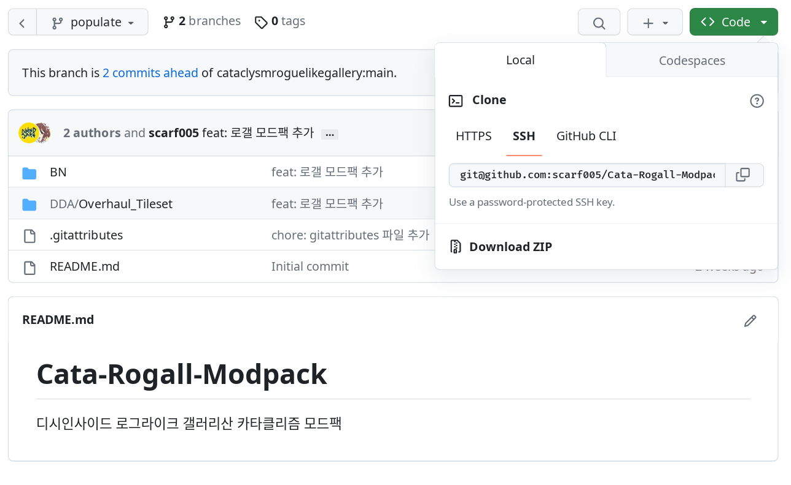

# Cata-Rogall-Modpack

디시인사이드 로그라이크 갤러리산 카타클리즘 모드팩

## 디렉터리 구조

### BN

- [Wield_Wild_Weapons](https://github.com/NappingOcean/Wield_Wild_Weapons): 짐승의 자세에서 비롯된 새로운 무기술을 추가합니다. 이 무기술은 특정한 석상을 찾아서 그 비급을 얻을 수 있습니다.
- [HOPE-Of-Perished-Era](https://github.com/NappingOcean/HOPE-Of-Perished-Era/tree/main): 멸망한 시대의 HOPE 에 얽힌 비밀을 찾아보세요. 카타클리즘의 세계에 조금은 감성적인 수집 아이템을 추가한 모드입니다.
- [AZFs_Mod](./BN/AZFs_Mod): 파워피스트 및 파워아머의 스탯 증가 효과 추가 모드
- [Dogmeat's Mod](./BN/Dogmeat's%20Mode/): 가방 편의성 증가 모드
- [Project: Squirrel](./BN/ProjectSquirrel): 파밍을 위한 다양한 컨텐츠 및 확장된 나노기술 활용 컨텐츠 추가 모드. 컴뱃아머, 드론, 메크, 하드라이트 무장, 가우스 무장 등 또한 있습니다.
- [New England Staff Arts](./BN/New%20England%20Staff%20Arts/): 무술: 뉴 잉글랜드 지팡이술을 추가합니다. 자동습득 가능합니다.
- [Revive_Hub01_Base](./BN/Revive_Hub01_Base/): 삭제된 허브01의 지하실, 그리고 허브01의 보안책임자 율리시스 루크를 되살리는 모드입니다.
- [Oil_and_Spinner](./BN/WildStuffs/): 심플하게 압착기와 방적기를 추가합니다.
- [better_cataclysm](./BN/better_cataclysm/): 카타클리즘의 불합리하고 불공평한 부분을 수정합니다.

### DDA

- [Overhaul_Tileset](./DDA/Overhaul_Tileset/): MX+Tileset(Overhaul)의 모드판. Overhaul 타일셋을 적용시키고, 새로운 외형을 추가합니다.

## 모드팩 설치법

1. 이 저장소 우측 위 초록색 `Code` 버튼을 누릅니다.
2. 아래에 있는 `Download ZIP`을 누릅니다.
3. 다운로드가 완료되면 압축을 풀고, 내부의 `BN` 또는 `DDA` 디렉터리에 있는 모드 폴더들을 카타클리즘의 `mods` 폴더에 넣습니다.

## Credits & Acknowledgements (크레딧 및 감사 인사)

이 모드는 다음 제작자들의 훌륭한 작업물이 없었다면 완성될 수 없었습니다.
This mod would not have been possible without the great work of the following creators.

### 🧬 Targeted Mutation (표적 돌연변이)
* Original Author (원작자): Mutaman, StandingStorm
* Original Mod Link (원본 모드 링크): https://github.com/Zlorthishen/BrightNights-Structured-Kenan-Modpack
* Changes Made (변경 사항):
* Translated into Korean (한국어 번역 적용)
* Fixed bugs and resolved compatibility issues (오류 및 호환성 문제 해결)
* Merged into this mod and modpack (본 모드와 모드팩에 병합됨)

### 🤖 Transformer beta 2 (메카 모드 변형 베타2)
* Original Author (원작자): Nyaa
* Changes Made (변경 사항):
* Merged into this mod and modpack (본 모드와 모드팩에 병합됨)

### 🎨 Sprites and Artworks (도트와 아트워크)
* thhoney03: Drew the sprites for Project: Packrat's Type-Boy!
* Project: Packrat의 타입-보이의 도트를 그려주셨습니다!

* Coalcat: Drew the spinning wheel sprite for Wildstuff mod!
* Wildstuff 모드의 방적기 도트를 그려주셨습니다!

### ⚙️ Maintainers (유지보수와 관리)
* NappingOcean, Scarf005: The administrator of this modpack provided tremendous assistance while serving in the military!
*  (본 모드팩의 관리자가 군 복무를 하는 동안 많이 도와주셨습니다!)

원작자의 노고에 깊은 감사를 드립니다!
Huge thanks to the original author for their amazing work!
